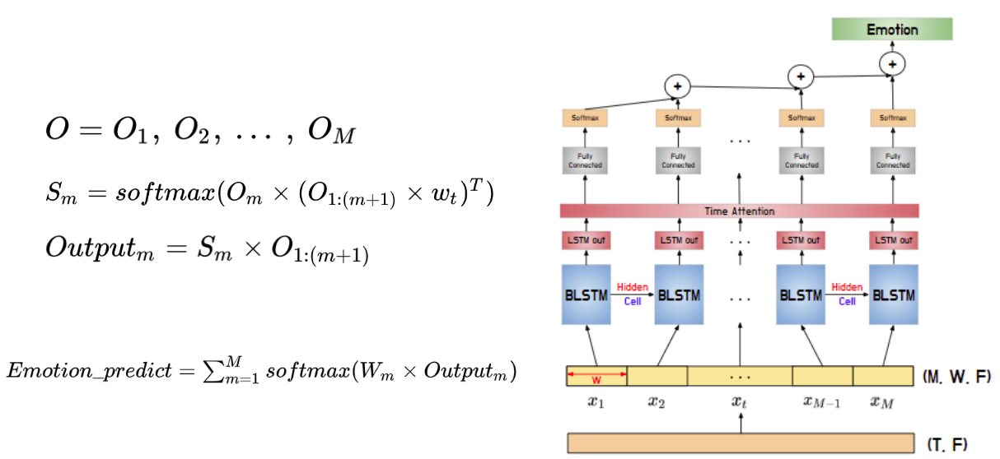

# Speech emotion recognition using dilated CNN and attention based sliding LSTM with 3D log mel-spectrogram

http://www.riss.kr/search/detail/DetailView.do?p_mat_type=be54d9b8bc7cdb09&control_no=daa95465bebc6229ffe0bdc3ef48d419

## 1. Model

**ADSRNN(dilated CNN with residual block and sliding BiLSTM based on the attention mechanism)**

-> CNN layer + RNN layer + Attention

**CNN layer**

**RNN layer**

**Attention**

## 2. Experiment

### `Dataset`

Dataset - The Interactive Emotional Dyadic Motion Capture (IEMOCAP)

Sampling Rate : 16K

Language : English

10 Actors : 5 male and 5 female

| Emotion | Num  |
| ------- | ---- |
| Angry   | 289  |
| Sad     | 608  |
| Happy   | 284  |
| Neutral | 1099 |
| Total   | 2280 |

### `Experiment setup`

10 fold cross validation

result : Mean and standard deviation of UAR(Unwighted Average Recall) 

Comparison Group

1. M. Chen, J. Yang, H. Zhang, and X. He, ‘‘3-D convolutional recurrent neural networks with attention model for speech emotion recognition,’’ IEEE Signal Process. Lett., vol. 25, no. 10, pp. 1440–1444, Oct. 2018.
2. H. Meng, Y. Tianhao, Y. Fel and W. Hongwei, “Speech emotion recognition from 3D log-mel spectrograms with deep learning network,” IEEE Access, 2019. 7: p. 125868-125881. 
3. Z. Peng, X. Li, Z. Zhu, M. Unoki, J. Dang and M. Akagi, "Speech Emotion Recognition Using 3D Convolutions and Attention-Based Sliding Recurrent Networks With Auditory Front-Ends," in IEEE Access, vol. 8, pp. 16560-16572, 2020, doi: 10.1109/ACCESS.2020.2967791.

​																					**1. ACRNN**

​																					**2. ADRNN**

​																					**3. ASRNN**(Transformed to fit our input)

## 3. Result

